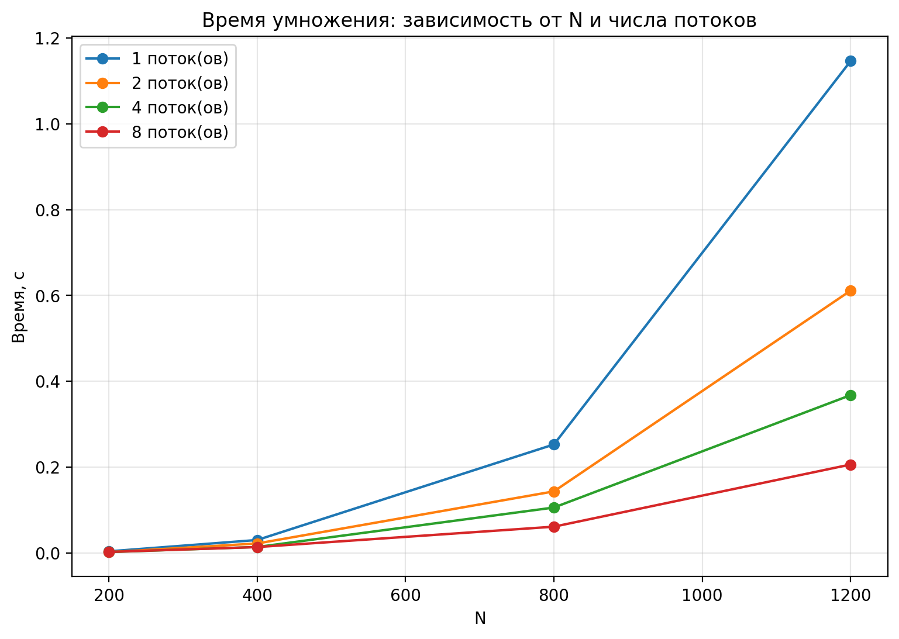
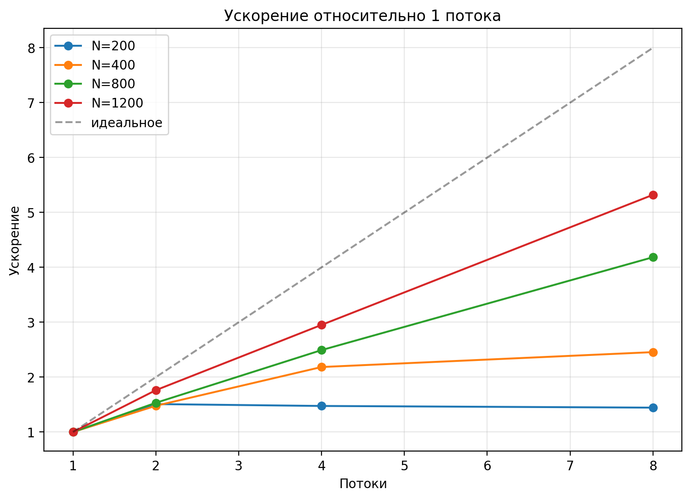

# Лабораторная работа: Параллельное умножение матриц (OpenMP)

## Задание
Написать на C/C++ программу для перемножения двух квадратных матриц.
Вход — файлы с матрицами, выход — файл результата + метрики (время,
объём задачи, GFLOPS). Обязательна автоматизированная верификация с
помощью NumPy. Исследовать зависимость времени от размера задачи и от
числа потоков (параметров распараллеливания).

## Структура репозитория

| Файл | Назначение |
|------|-----------|
| `main.cpp` | Умножение матриц с OpenMP, замер времени, верификация |
| `generate.py` | Генерация случайных матриц (seed=42, воспроизводимо) |
| `verify.py` | Сверка результата с NumPy по относительной погрешности |
| `run.sh` | Прогон по N = 200,400,800,1200 и потокам 1,2,4,8 |
| `plot.py` | Построение графиков по results.csv |
| `results.csv` | Все замеры |
| `graph_time.png` | Зависимость времени от N и потоков |
| `graph_speedup.png` | Ускорение относительно 1 потока |

## Алгоритм и распараллеливание

Умножение C = A*B. Сложность O(N^3), объём задачи ~ 2N^3 операций с
плавающей точкой. Порядок циклов i-k-j даёт последовательный доступ к
строкам B и C (row-major) — лучше локальность кэша, чем у
классического i-j-k.

Распараллеливание — по строкам результата:

    #pragma omp parallel for schedule(static)
    for (int i = 0; i < n; i++) { ... }

Каждая итерация внешнего цикла независима, синхронизация не требуется,
итог детерминированный (не зависит от числа потоков).

## Как запустить

    # один запуск
    python3 generate.py 400
    g++ -O2 -fopenmp main.cpp -o matrix_mult
    ./matrix_mult 4 5      # 4 потока, 5 прогонов
    python3 verify.py

    # полное исследование
    chmod +x run.sh
    ./run.sh
    python3 plot.py

## Методика измерений

- Прогрев перед замерами (в зачёт не идёт).
- Усреднение по 5 прогонам, время берётся steady_clock (монотонные часы).
- GFLOPS = 2*N^3 / (t * 1e9), где t — среднее время в секундах.
- Верификация — относительная погрешность к NumPy: ||C_num - C_cpp|| / ||C_num||.

## Результаты экспериментов

Все 16 прогонов (4 размера x 4 потока) прошли верификацию (OK).
Матрицы — случайные double из [0,1), seed=42.

### Время выполнения (секунды, среднее по 5 прогонам)

| N \ T | 1 | 2 | 4 | 8 |
|-------|---|---|---|---|
| 200   | 0.003828 | 0.002536 | 0.002595 | 0.002650 |
| 400   | 0.031231 | 0.021126 | 0.014297 | 0.012717 |
| 800   | 0.245569 | 0.160267 | 0.098515 | 0.058658 |
| 1200  | 1.117909 | 0.634276 | 0.378730 | 0.210086 |

### Производительность (GFLOPS)

| N \ T | 1 | 2 | 4 | 8 |
|-------|---|---|---|---|
| 200   | 4.18 | 6.31 | 6.17 | 6.04 |
| 400   | 4.10 | 6.06 | 8.95 | 10.07 |
| 800   | 4.17 | 6.39 | 10.39 | 17.45 |
| 1200  | 3.09 | 5.45 | 9.13 | 16.45 |

### Ускорение (Speedup = T1 / Tp) и эффективность

| N | T=2 | T=4 | T=8 |
|---|-----|-----|-----|
| 200  | 1.51x (75%) | 1.47x (37%) | 1.44x (18%) |
| 400  | 1.48x (74%) | 2.18x (55%) | 2.46x (31%) |
| 800  | 1.53x (77%) | 2.49x (62%) | 4.19x (52%) |
| 1200 | 1.76x (88%) | 2.95x (74%) | 5.32x (67%) |

## Графики

## Выводы

1. Время растёт как O(N^3). При увеличении N в 6 раз (200 -> 1200)
   время на 1 потоке выросло в ~292 раза — примерно как 6^3 = 216
   плюс эффекты кэша для больших матриц.

2. Распараллеливание даёт тем больший эффект, чем крупнее задача.
   Для N=1200 ускорение на 8 потоках — 5.32x, для N=200 — только
   1.44x. Мелкие задачи не успевают окупить накладные расходы
   (создание потоков, синхронизация в конце parallel for).

3. Эффективность (Speedup/T) на больших задачах растёт: для
   N=1200 она составляет 67% на 8 потоках. Ограничение — закон Амдала
   (последовательная доля 5-10% на служебных операциях) и пропускная
   способность памяти: для этой задачи на каждый элемент приходится
   мало вычислений относительно обращений к B[k][j].

4. На N=200 распараллеливание почти не помогает — время 1 потока
   3.8 мс, время 8 потоков 2.65 мс. Разница меньше накладных расходов
   OpenMP. Это типично для мелкозернистых задач.

5. Пиковая производительность — 17.45 GFLOPS (N=800, T=8).
   На N=1200 производительность чуть ниже (16.45) — матрицы уже не
   помещаются в L2/L3, кэш-промахи снижают эффективность.

6. Детерминированность. Каждый запуск дал одинаковый результат,
   независимо от числа потоков — верификация с NumPy прошла во всех
   случаях с относительной погрешностью ~1e-10 (предел точности
   double при разном порядке суммирования).

## Возможные улучшения

- Блочное умножение (tiling) — уменьшить кэш-промахи на больших N.
- Транспонирование B — тогда B[k][j] превратится в Bt[j][k],
  оба массива читаются последовательно.
- OpenMP + SIMD или библиотеки типа BLAS (MKL, OpenBLAS) — там уже
  используются векторизация и многоуровневые блоки.

## Автор
Тимофеева Елизавета, группа 6213, https://github.com/lizaa207/timofeevaliza_parallel_programm_lab
